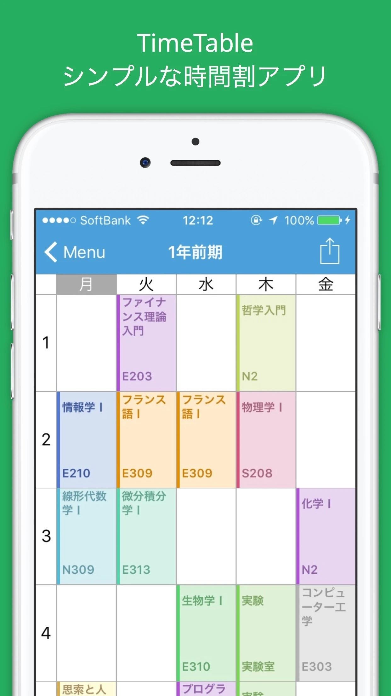

# TimeTable - Class Scheduler

## Overview

TimeTable is an iOS app that allows students to manage their academic schedules. It achieved more than 53,000 downloads on [App Store](https://itunes.apple.com/US/app/id981480777?mt=8) from 2014 to 2021. The app is no longer available on App Store.

## Core Features

- Table view of academic schedule, based on UICollectionView
- Supported both iPhone and iPad
- iCloud data sync by CoreData
- Export/Sync schedules with iOS Calendar app by EventKit

## Author

* [**Shuhei Fujita**](https://github.com/shuheif)

## Reference

- [TimeTable Website](http://timetable.strikingly.com/)
- [iOSアプリ 6年間の開発まとめ](https://medium.com/@shuheifujita/iosアプリ-6年間の開発まとめ-fcddd98347c8): A blog article on my marketing strategy for TimeTable (in Japanese)
